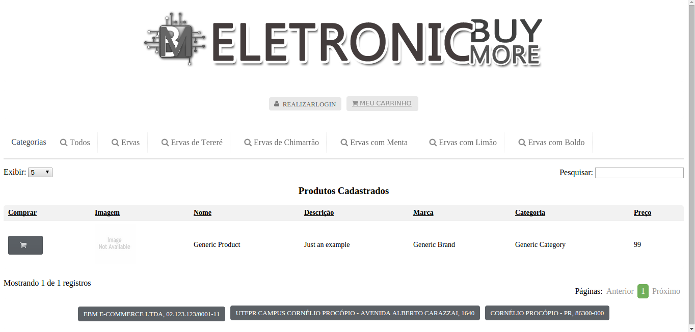
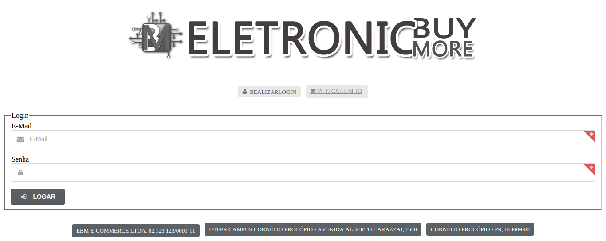
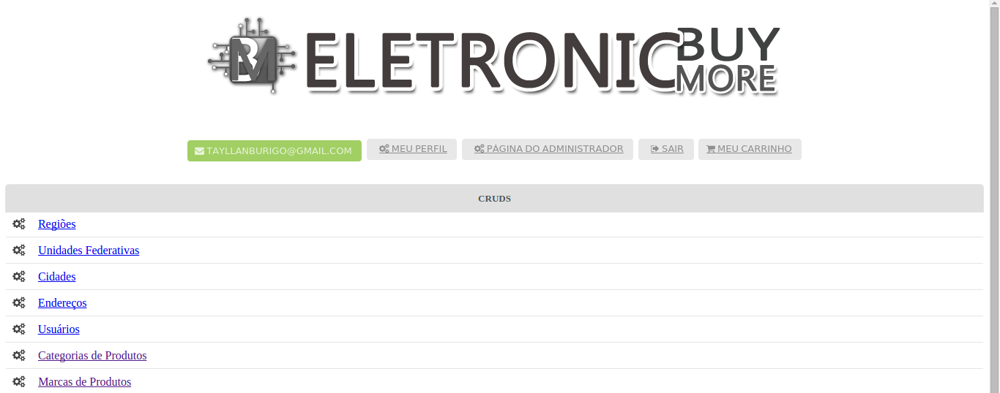

# EBM
## Description
This was a web project developed in my second year of college at the [Federal Technological University of Paraná](http://utfpr.edu.br/). It's intended to be a "small and generic e-commerce system". The EBM name stands for "Electronic Buy More" (in the logo image the name is written wrong because it was made by a friend, and I don't really know how to fix it).

Unfortunately everything inside the source code is written in Portuguese (since it was a college project), but it should still serve as portfolio.

## Technologies used
* PHP 5.5 as the back-end language.
* HTML5, CSS3 and JavaScript as the front-end languages.
* Apache HTTP Server 2.4.7.
* Model-View-Controller architectural pattern.
* MySQL Relational Database Management System.
* The Brazilian Post Office API for automatic address registration and shipping prices calculation (which isn't online anymore...).

### Libraries
* [OpenBoleto](http://kriansa.github.io/openboleto/) - Used to generate bank slip.
* [DynaTable](http://www.dynatable.com/) - To create pretty product tables.
* [Semantic UI](http://semantic-ui.com/) - The CSS and Validations framework.
* [JQuery](http://jquery.com/) - Used by Semantic UI.

***

***

***
